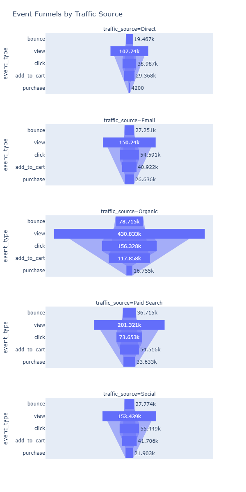

📊 Digital Marketing Campaign Analysis — Exploratory Data Analysis (EDA)
Project Overview

This project presents an end-to-end Exploratory Data Analysis (EDA) of digital marketing campaigns to understand revenue performance, conversion behavior, and campaign effectiveness over a three-year period (2021–2023).

The analysis focuses on identifying drivers behind declining revenue trends, evaluating channel and campaign performance, and providing data-backed recommendations for sustainable revenue growth.

All analysis was conducted using Python with a strong emphasis on clean data modeling, reproducibility, and business relevance.

Business Questions & Key Findings
1️⃣ What is the annual revenue trend?

Finding:
📉 Annual net revenue is declining year-on-year by ~0.8% from 2021 to 2023.

Visualization:


2️⃣ Why is revenue declining?

Key diagnostics revealed:

✅ Transaction volume increased by ~1% in FY23 vs FY22

❌ Revenue per transaction declined, driving overall revenue drop

❌ Revenue declined across all acquisition channels except Organic

Conclusion:
The issue is not demand, but lower monetization efficiency per transaction.

3️⃣ Channel Performance Analysis

Highest conversion rates:

Email: 17.7%

Paid Search: 16.7%

Overall conversion rate: 9.9%

Direct and Organic conversion rates (~3.9%) are significantly below expectations

Visualization:


4️⃣ Campaign Effectiveness & Reusability

Analysis of the top revenue-generating campaigns revealed:

Only 1 out of the top 7 campaigns was repeated in 2023

High-performing campaign archetypes were not consistently reused

Campaign performance is highly repeatable, not one-off

Recommendations for Revenue Growth
🚀 Recommendation 1: Reuse High-Performing Campaigns

Only Paid Search – Cross-sell – High Value was repeated among top performers

Top campaigns should be:

Re-run annually

Even at shorter durations if needed

📈 Impact Estimate:
Assuming a conservative 50% uplift per repeated campaign, re-running top campaigns could add:

₹700K+ incremental annual revenue

~25% YoY revenue growth

🚀 Recommendation 2: Scale High-Conversion Channels

Shift incremental budget toward:

Email

Paid Search

These channels outperform the overall average conversion by ~75%

Action:
Increase campaign volume and audience reach within these channels.

Key Takeaways

Revenue decline is driven by lower revenue per transaction, not fewer purchases

Campaign reuse is a major untapped opportunity

Email and Paid Search are the most efficient levers for growth

Organic growth alone cannot offset monetization decline

Next Steps / Future Enhancements

Customer cohort analysis by acquisition channel

Campaign ROI vs expected uplift validation

A/B testing framework for campaign duration optimization

Predictive modeling for campaign revenue forecasting

Repository Structure
```
Campaign_Analysis_EDA_Project/
│
├── raw_data_files/
│   ├── campaigns.csv
│   ├── customers.csv
│   ├── events.csv (large file - not uploaded to github)
│   ├── products.csv
│   └── transactions.csv
│
├── EDA_code/
│   └── campaign_analysis_eda.ipynb
│
├── charts/
│   ├── channel wise conversion funnels.png
│   ├── customers by acquistion channel.png
│   ├── customers by age.png
│   ├── customers by country.png
│   ├── customers by loyalty tier.png
│   ├── monthly revenue pattern.png
│   ├── number of campaigns by channel.png
│   ├── number of campaigns by objective.png
│   ├── number of campaigns by target segment.png
│   ├── overall conversion funnel.png
│   ├── product categories.png
|   ├── YoY Revenue Trend.png
│
├── README.md
│
└── Sumamry of analysis.xlsx
```
Tools & Technologies

Language: Python

Libraries: pandas, numpy, matplotlib, plotly

Environment: VS Code, Jupyter Notebook

Techniques:

Data cleaning & feature engineering

Aggregations & pivots

Funnel analysis

Time-series trend analysis

Campaign-level performance evaluation

Data Preparation & Cleaning

Key preprocessing steps included:

Converting timestamp and date fields from object to datetime

Standardizing categorical fields (e.g., traffic_source)

Resolved inconsistencies such as EMAIL, Email, email

Deriving additional features:

year, month, year_month

net_revenue (after discounts and refunds)

Ensuring transaction counts were net of refunds

This ensured consistency and accuracy across all downstream analyses.

Author Notes

This project is designed to reflect real-world business analytics workflows, with emphasis on:

Structured thinking

Clear communication of insights

Quantified, actionable recommendations

Ideal for showcasing skills relevant to Senior Data Analyst / Marketing Analytics / Product Analytics roles.
